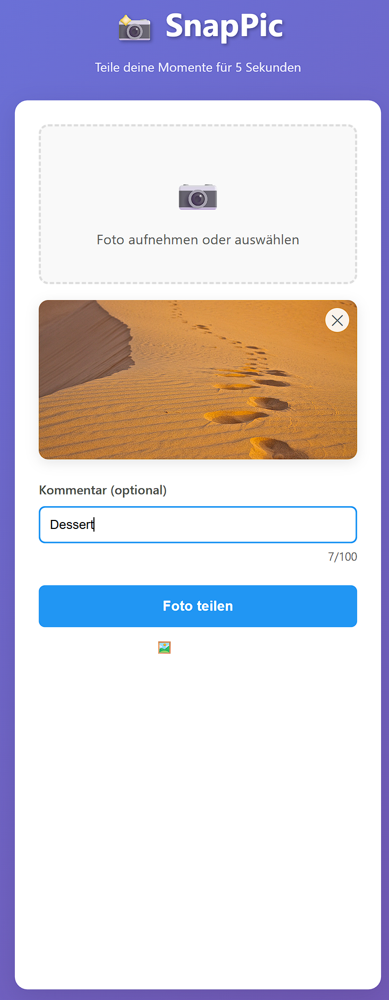
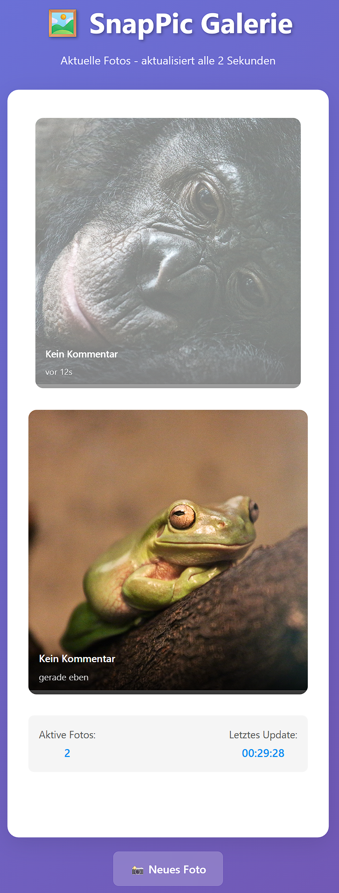

# 📸 SnapPic

A modern Progressive Web App for sharing photos that disappear after 15 seconds. Built with Flask and vanilla JavaScript.

## 🌟 Features

- **Instant Photo Sharing**: Take photos with your camera or upload from gallery
- **Temporary Display**: Photos are visible for 5 seconds, then fade out over 10 seconds before automatic deletion
- **Progressive Web App**: Install on mobile devices for app-like experience
- **Real-time Gallery**: Auto-refreshes every 2 seconds to show latest photos
- **Mobile-First Design**: Optimized for smartphones with responsive Material Design
- **Offline Support**: Service Worker enables basic offline functionality

## 📱 Screenshots

### Upload Interface


### Gallery View


## 🚀 Quick Start

1. **Install Dependencies**
   ```bash
   pip install flask
   ```

2. **Run the Application**
   ```bash
   cd snappic
   python app.py
   ```

3. **Open in Browser**
   ```
   http://localhost:5000
   ```

## 📁 Project Structure

```
jfs_claude/
├── README.md             # This file
├── index.png            # Screenshot - Upload interface
├── gallery.png          # Screenshot - Gallery view
└── snappic/             # Main application directory
    ├── app.py           # Flask application with all routes
    ├── data.json        # Photo metadata storage
    ├── requirements.txt # Python dependencies
    ├── templates/
    │   ├── index.html   # Photo upload interface
    │   └── gallery.html # Gallery view
    ├── static/
    │   ├── style.css    # Styling for all pages
    │   ├── script.js    # JavaScript functionality
    │   ├── manifest.json # PWA manifest
    │   ├── sw.js        # Service Worker
    │   └── icon-*.png   # PWA icons
    └── uploads/         # Photo storage (auto-created)
```

## ⚙️ Configuration

Edit timing settings in `snappic/app.py`:

```python
DISPLAY_TIME = 5    # Seconds photos are fully visible
FADEOUT_TIME = 10   # Seconds for fade-out animation
MAX_IMAGES = 10     # Maximum concurrent photos
```

## 🔧 Technical Details

- **Backend**: Flask (Python)
- **Frontend**: Vanilla HTML/CSS/JavaScript
- **Storage**: Local JSON file + filesystem
- **Supported Formats**: JPG, PNG, WEBP
- **Max File Size**: 5MB
- **Auto-cleanup**: Background thread removes expired photos

## 📱 PWA Installation

1. Open the app in a mobile browser
2. Look for "Add to Home Screen" prompt
3. Follow browser-specific installation steps
4. Use as a native app!

## 🛡️ Security Features

- File type validation
- File size limits
- Secure filename handling
- Automatic cleanup of expired content

## 🔄 API Endpoints

- `GET /` - Upload interface
- `GET /gallery` - Gallery view
- `POST /upload` - Photo upload
- `GET /api/images` - JSON data of current photos
- `GET /uploads/<filename>` - Serve uploaded photos

## 🤖 Development

This project was created with [Claude Code](https://claude.ai/code), Anthropic's AI-powered development assistant.

## 📄 License

Open source - feel free to modify and use for your own projects!